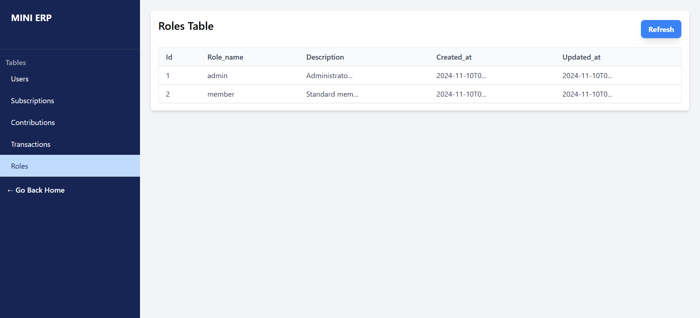

# MINI ERP Application
> Related Repositories:
> - [MINI_ERP_cron](https://github.com/FREDRICKKYEKI/MINI_ERP_cron) - Cron jobs for the MINI ERP application.




## Overview

The MINI ERP is a small-scale Enterprise Resource Planning (ERP) application designed to handle basic user management, role-based access, transaction handling, subscription tracking, and contribution recording for a business or organization. This README provides setup instructions, usage guidelines, and information on the app’s structure.

## How it Works
This is a basic application that allows users to:
1. register,
1. log in,
1. subscribe,
1. and make contributions.

- After registration, users can subscribe to a plan and make contributions. The app tracks user transactions, subscriptions, and contributions, and sends email notifications for subscription expiration and reminders.


## Table of Contents
1. [Features](#features)
1. [Why PesaPal](#why-pesapal)
1. [Tech Stack](#tech-stack)
1. [Prerequisites](#prerequisites)
1. [Installation](#installation)
1. [Database Schema](#database-schema)
1. [Usage](#usage)
1. [Security](#security)

## Features

- **User Management**: Register and manage users with different roles and privileges.
- **Role Management**: Define roles and assign them to users (e.g., admin, member).
- **Transactions**: Track and record financial transactions, including subscriptions and contributions.
- **Subscriptions**: Manage user subscriptions, track their status, and set expiration dates.
- **Contributions**: Track user contributions with a purpose and maintain transaction history.
- **Automated Email Notifications**: Send alerts for subscription expiration and reminders.

- The app has a simple admin dashboard to view the database tables.
- A cron job runs daily to send email notifications to users with subscriptions expiring in five days and those whose subscriptions expire on the current day.
- Finally, the app uses JWT for authentication and bcrypt for password hashing (salted).
- The app is built using Node.js with Sequelize ORM and MySQL database.
- The app uses [Pesapal](https://pesapal.com/) for payment processing.

# Why PesaPal
1. It is Kenyan friendly, with direct MPESA integration with STKPush functionality which prompts a user to pay directly.
1. It is a secure payment gateway.
1. The alternative don't support **KSH** currency unlike it's alternatives (PayPal, Stripe). This enables us to properly price our products in KSH without having to do currency conversions.

## Tech Stack

- **Backend**: Node.js with Sequelize ORM
- **Database**: MySQL
- **API Documentation**: Postman or Swagger (optional)
- **Authentication**: JSON Web Tokens (JWT)
- **Payment Gateway**: Pesapal (for payment processing)

## Prerequisites

- **Node.js** (>=14.x recommended)
- **MySQL** (>=8.x recommended)
- **NPM** (Node Package Manager)
- **Postman** (for API testing)

## Installation

1. **Clone the repository:**
   ```bash
   git clone https://github.com/username/MINI_ERP.git
   cd MINI_ERP
   ```

2. **Install dependencies:**
   ```bash
   npm install
   ```

3. **Configure MySQL Database:**
   - Please find the database setup for [MySql Database Setup](./dev_db_setup.sql) and [SQLite setup](./dev_db_sqlite_setup.sql).
   - Create a database named `mini_erp_db` in MySQL.
   - Run the SQL scripts to create tables and sample data.

1. **Run ngrok:**
   ```bash
   ngrok http 5173
   ```
   - Copy the forwarding URL (e.g., `https://xxxxxx.ngrok.io`) for webhook setup.
   - Paste it in the `BACKEND.ENV` file under `IPN_BASE_URL`.
   - Watch [this](https://www.youtube.com/watch?v=gdfxoNfVxMU&ab_channel=UMESKIASOFTWARES) video to learn how to install/use ngrok.

4. **Environment Configuration:**
   - Create a `BACKEND.ENV` file in the project root (the name is IMPORTANT and case-sensitive).:
     ```bash
        MYSQL_USER=dev_user
        MYSQL_PASSWORD=pwd
        MYSQL_DATABASE=MINI_ERP_dev_db
        MYSQL_HOST=localhost
        MYSQL_PORT=3306
     ```
- **Kindly ask for the `.env` file from the developer.**

6. **Run the App:**
   ```bash
   npm run dev
   ```
   The app will be running at `http://localhost:5173`.

7. **Production Build:**
   ```bash
   npm run build
   npm run preview
   ```

## Database Schema

### Tables
- **Users**: Stores user information, including email, password, and role.
- **Roles**: Defines roles and privileges in the system (e.g., admin, member).
- **Transactions**: Logs all transactions for subscriptions and contributions.
- **Subscriptions**: Tracks user subscription details and expiration.
- **Contributions**: Records user contributions with transaction links.

### Sample Tables
```sql
-- Create the `roles` table
CREATE TABLE IF NOT EXISTS roles (
    id INT AUTO_INCREMENT PRIMARY KEY,
    role_name VARCHAR(50) UNIQUE NOT NULL,
    description VARCHAR(255),
    created_at TIMESTAMP DEFAULT CURRENT_TIMESTAMP,
    updated_at TIMESTAMP DEFAULT CURRENT_TIMESTAMP ON UPDATE CURRENT_TIMESTAMP
);

-- Create the `users` table
CREATE TABLE IF NOT EXISTS users (
    id CHAR(36) PRIMARY KEY,
    name VARCHAR(100) NOT NULL,
    email VARCHAR(100) UNIQUE NOT NULL,
    phone VARCHAR(15),
    password VARCHAR(255) NOT NULL,
    role_id INT,
    created_at TIMESTAMP DEFAULT CURRENT_TIMESTAMP,
    updated_at TIMESTAMP DEFAULT CURRENT_TIMESTAMP ON UPDATE CURRENT_TIMESTAMP,
    FOREIGN KEY (role_id) REFERENCES roles(id) ON DELETE SET NULL ON UPDATE CASCADE
);
```
## Usage

### Pages
- **/** - Home page with basic information about the app.
- **/login** - Login page for users to sign in.
- **/register** - Registration page for new users.
- **/admin/dashboard** - Simple admin dashboard to see the tables in the database.
- **/plans** - Subscription plans page for users to view and select.
- **/success** - Success page after a successful transaction.

### API Endpoints
 * **/api/v1/pesapal** - routes are not exposed to the public. They should be protected with a secret key.
 * **/api/v1/submitOrder** - submit an order to pesapal to get a payment link
 * **/api/v1/auth** - authentication routes
 * **/api/v1/admin** - admin routes
 * **/api/v1/cron** - cron routes

### Automated Cron Jobs
> REPO: [MINI_ERP_cron](https://github.com/FREDRICKKYEKI/MINI_ERP_cron)
- A daily cron job (using Node.js `cron`) runs to:
  - Send an email notification to users with subscriptions expiring in five days.
  - Send expiration notices to users whose subscriptions expire on the current day.

## Security

- **Password Encryption**: Passwords are hashed using **bcrypt** (salted hashing).
- **JWT Authentication**: Used for secure API access (using access cookies).
- **Role-Based Access Control**: Access is restricted based on user roles.

## Testing
*Not yet implemented!!!*

Run tests using the command:
```bash
npm test
```

## Troubleshooting

1. **MySQL Access Denied**:
   - Ensure you have set up correct user privileges in MySQL.
2. **Environment Variables Missing**:
   - Check `BACKEND.ENV` for all required keys.

## License

This project is licensed under the MIT License.

---

This `README.md` provides a clear overview of the MINI ERP application and setup steps. Make sure to replace example values (like repository URL) with actual details specific to your project setup.